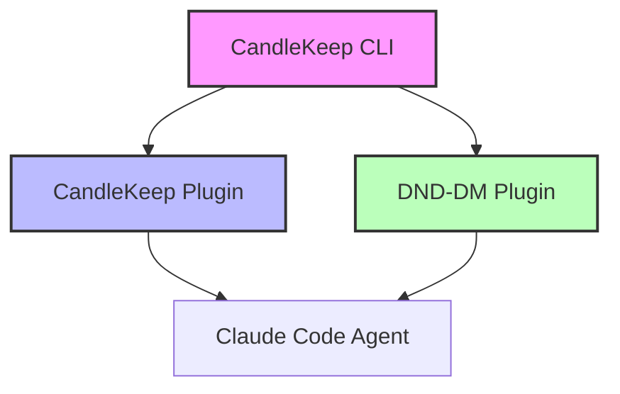

# CandleKeep Plugin Marketplace

<p align="center">
  
</p>

> *A curated collection of Claude Code plugins for personal knowledge management and D&D gameplay*

[]()
[]()

Welcome to the CandleKeep Plugin Marketplace! This is a specialized collection of Claude Code plugins centered around knowledge management and tabletop gaming, all built on the foundation of the CandleKeep knowledge base system.

---

## What is this?

This marketplace hosts two interconnected plugins:

1. **CandleKeep** - Personal knowledge base system for books
2. **DND-DM** - D&D Dungeon Master assistant (requires CandleKeep)

Both plugins work together to give AI agents direct access to your book collection, enabling them to reference actual source material rather than relying solely on training data.

---

## Quick Start

### 1. Install CandleKeep CLI (Required First)

CandleKeep is the foundation that other plugins depend on:

```bash
# Clone this marketplace repository
git clone https://github.com/SaharCarmel/CandleKeep.git
cd CandleKeep
```

### 2. Add Marketplace to Claude Code

Add this marketplace to your Claude Code project by creating or updating `.claude/config.json`:

```json
{
  "marketplaces": [
    {
      "name": "candlekeep-marketplace",
      "source": "github",
      "repo": "SaharCarmel/CandleKeep"
    }
  ]
}
```

### 3. Install and Initialize CandleKeep

```bash
# Symlink CandleKeep plugin to Claude skills directory
ln -s $(pwd)/plugins/candlekeep/skills/candlekeep ~/.claude/skills/candlekeep

# Install dependencies
cd ~/.claude/skills/candlekeep
uv sync

# Initialize CandleKeep
uv run candlekeep init

# Add your first book
uv run candlekeep add-pdf ~/Books/my-book.pdf
```

### 4. Optional: Install DND-DM Plugin

If you want to run D&D campaigns:

```bash
# Symlink DND-DM plugin
ln -s $(pwd)/plugins/dnd-dm/skills/dnd-dm ~/.claude/skills/dnd-dm
ln -s $(pwd)/plugins/dnd-dm/skills/npc-voice ~/.claude/skills/npc-voice

# Install Node dependencies (optional for NPC voices)
cd ~/.claude/skills/dnd-dm
npm install
```

---

## Available Plugins

### 📚 CandleKeep - Knowledge Base System

**Category**: Productivity
**Version**: 0.1.0
**Status**: Early Development

Personal knowledge base system that gives AI agents direct access to your books.

#### Features
- Add PDF and Markdown books to your library
- Query books with precise page citations
- Extract table of contents and specific sections
- Token-efficient progressive disclosure workflow
- Local-first storage (all data stays on your machine)
- Privacy-focused (no external data transmission)

#### Use Cases
- Research assistance with actual source citations
- Learning with AI that references your study materials
- Professional work grounded in your domain expertise books
- Knowledge transfer through "agent-optimized" books

#### Quick Commands
```bash
uv run candlekeep init              # Initialize
uv run candlekeep list              # List all books
uv run candlekeep toc <id>          # Show table of contents
uv run candlekeep pages <id> 10 15  # Extract pages 10-15
uv run candlekeep add-pdf <file>    # Add PDF book
uv run candlekeep add-md <file>     # Add markdown book
```

**Learn more**: [plugins/candlekeep/README.md](./plugins/candlekeep/README.md)

---

### 🎲 DND-DM - Dungeon Master Assistant

**Category**: Entertainment
**Version**: 0.1.0
**Status**: Early Development
**Prerequisites**: ⚠️ **Requires CandleKeep plugin installed first**

Complete D&D 5e Dungeon Master assistant with campaign management, dice rolling, and optional AI-powered NPC voices.

#### Features
- **Adventure Book Integration**: References D&D adventures stored in CandleKeep
- **Campaign Management**: Track sessions, character progression, story arcs
- **Two Game Modes**:
  - Adventure Mode (immersive, hidden DM info)
  - Debug Mode (transparent, all info visible)
- **Dice Rolling**: Full D&D mechanics with advantage/disadvantage
- **NPC Voices**: Optional ElevenLabs AI text-to-speech for character voices
- **Session Logging**: Complete campaign history in single markdown file

#### Voice Presets (Optional TTS)
goblin, dwarf, elf, wizard, warrior, rogue, cleric, merchant, guard, noble, villain, narrator

#### Quick Commands
```bash
/dm-prepare              # Resume/start campaign
/dm-wrap-up             # End session and save progress
/dm-start-campaign      # Interactive campaign initialization
./roll-dice.sh 1d20+5   # Roll dice with modifiers
```

#### Setup Requirements
1. **CandleKeep must be installed** (DND-DM calls CandleKeep to access adventure books)
2. Add D&D books to CandleKeep:
   ```bash
   cd ~/.claude/skills/candlekeep
   uv run candlekeep add-pdf ~/DND/lost-mine-of-phandelver.pdf
   uv run candlekeep add-pdf ~/DND/players-handbook.pdf
   uv run candlekeep add-pdf ~/DND/monster-manual.pdf
   ```
3. Optional: Add ElevenLabs API key for NPC voices (free tier: 10,000 chars/month)

**Learn more**: [plugins/dnd-dm/README.md](./plugins/dnd-dm/README.md)

---

## How Plugins Work Together



**DND-DM depends on CandleKeep** - It calls CandleKeep CLI commands to access adventure books and rulebooks during D&D sessions.

**Installation Order**:
1. Install CandleKeep first
2. Add your D&D books to CandleKeep
3. Install DND-DM
4. Start playing!

---

## Marketplace Structure

```
CandleKeep/
├── .claude-plugin/
│   └── marketplace.json          # Plugin catalog
├── schema/
│   └── marketplace-schema.json   # JSON schema for validation
├── scripts/
│   ├── add-plugin.sh            # Helper scripts
│   └── validate.sh
├── plugins/
│   ├── candlekeep/              # Core knowledge base plugin
│   │   ├── .claude-plugin/
│   │   │   └── plugin.json
│   │   ├── README.md
│   │   └── skills/
│   │       └── candlekeep/      # Python CLI tool
│   │           ├── SKILL.md
│   │           ├── src/
│   │           ├── alembic/
│   │           └── pyproject.toml
│   │
│   └── dnd-dm/                  # D&D DM assistant plugin
│       ├── .claude-plugin/
│       │   └── plugin.json
│       ├── README.md
│       ├── commands/            # Slash commands
│       ├── templates/
│       └── skills/
│           ├── dnd-dm/          # Main DM skill
│           │   ├── SKILL.md
│           │   ├── roll-dice.sh
│           │   └── speak-npc.js
│           └── npc-voice/       # TTS skill
│
├── README.md                     # This file
├── CONTRIBUTING.md              # Contribution guidelines
└── LICENSE                       # MIT License
```

---

## Installation Paths

When installed via Claude Code, plugins live in:

```
~/.claude/skills/
├── candlekeep/
│   ├── src/candlekeep/         # Python CLI code
│   ├── alembic/                # Database migrations
│   └── pyproject.toml
│
└── dnd-dm/
    ├── roll-dice.sh            # Dice roller
    ├── speak-npc.js            # NPC voice (optional)
    └── sessions/               # Campaign data
```

CandleKeep data (your book library) is stored separately in:
```
~/.candlekeep/
├── candlekeep.db              # SQLite database (metadata)
├── library/                   # Converted markdown books
└── originals/                 # Original PDF/MD files (optional)
```

---

## Validation

Validate marketplace structure:

```bash
./scripts/validate.sh
```

---

## Contributing

Interested in adding plugins to this marketplace or improving existing ones?

See [CONTRIBUTING.md](./CONTRIBUTING.md) for:
- Plugin development guidelines
- How to add new plugins
- Testing procedures
- Submission process

---

## License

Individual plugins may have their own licenses. See plugin directories for details.

- CandleKeep Plugin: MIT License
- DND-DM Plugin: MIT License

---

## Why "CandleKeep"?

In Dungeons & Dragons lore, Candlekeep is a fortress library dedicated to the collection and preservation of knowledge. It's a place where seekers of wisdom come to learn, researchers come to discover, and knowledge is treated as sacred.

Our CandleKeep aspires to the same principle: creating a sanctuary for knowledge in the age of artificial intelligence, where wisdom isn't just stored—it's actively used, connected, and amplified through AI agents.

---

## Support

- **Issues**: https://github.com/SaharCarmel/CandleKeep/issues
- **Discussions**: https://github.com/SaharCarmel/CandleKeep/discussions
- **Documentation**: See individual plugin README files

---

*Built with the belief that AI agents work best when they have access to actual source material, not just training memories.*
